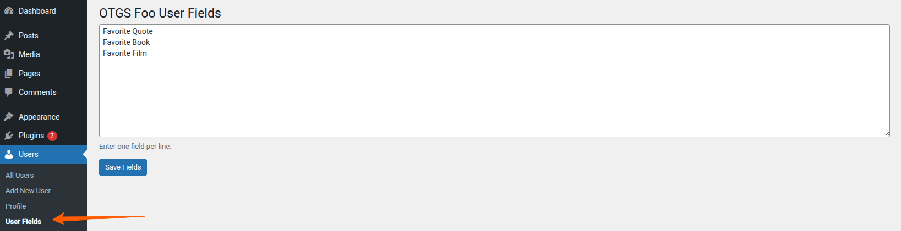
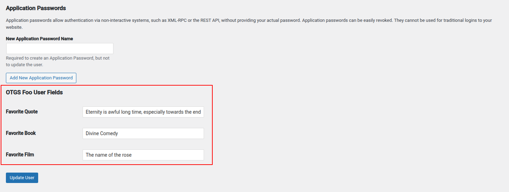
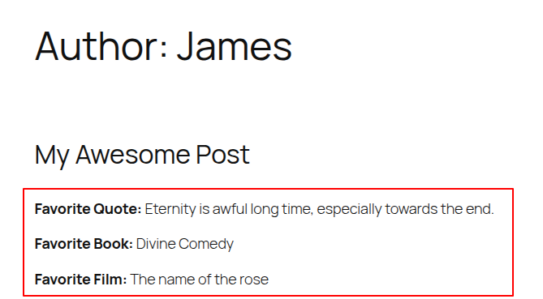
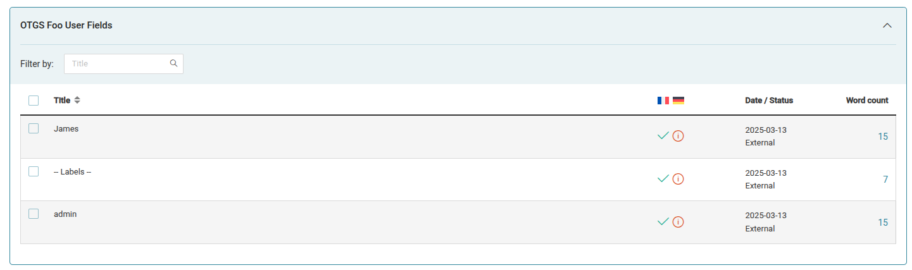
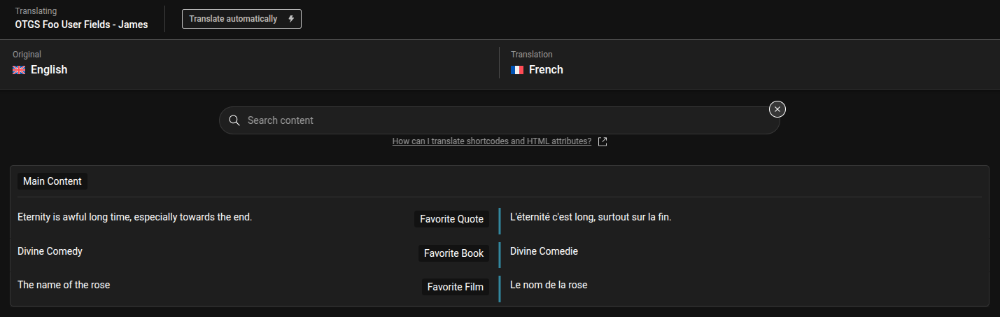
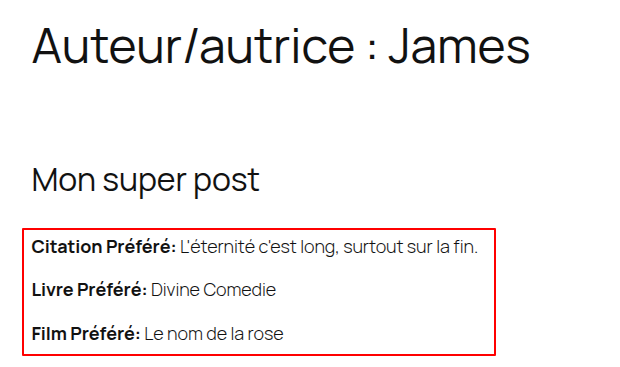

# OTGS Foo User Fields

This an example of a WordPress plugin allowing to add custom user fields and display it on the author's page.

**The purpose of this project is to demonstrate the integration with the [WPML String Packages](https://wpml.org/documentation/support/string-package-translation/).**

## Before WPML integration

We can define some extra user fields:

Then, each user can fill these extra fields in their profile:

Eventually, we can see these extra fields displayed on the author page:

## After WPML integration

We can send the extra user fields to translation through the Translation Management Dashboard (1 package per user):

And then translate it with the Advanced Translation Editor:

Eventually, we can see the extra user fields translated on the frontend (author's page in the secondary language):

## Notes

### Translating the field labels

The field labels are dynamic, it's defined by the site admin.
But we also need to have it translated on the frontend.
To keep the example simple, the field labels are using the same string package kind as the one used for the field values.
To prevent ID collisions with user entities, we are using a non-numerical package name `-- Labels --`.

### Commits

There are 3 main commits, to follow the integration steps:
- [compdev-683] Initial commit (the base plugin).
- [compdev-683] Integrate user fields with WPML
- [compdev-683] Extend the WPML integration to translate the field labels
